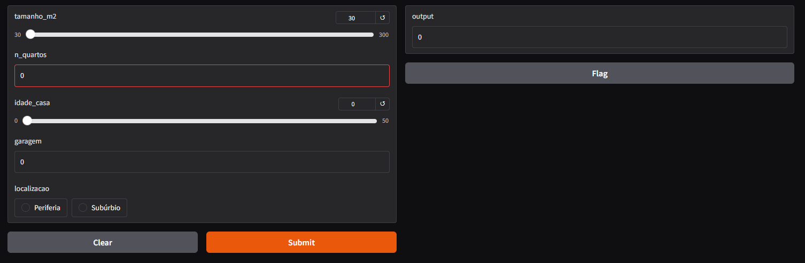

# 🏠 Predição de Valor de Aluguel com Regressão Múltipla

Este projeto utiliza **regressão múltipla** para estimar o valor de aluguel de um imóvel com base em atributos físicos e localização. O objetivo é construir um modelo interpretável e validar estatisticamente seu comportamento, garantindo previsões consistentes e confiáveis.

---

## 📚 Sumário

- [Objetivo](#objetivo)
- [Tecnologias](#tecnologias)
- [Como Executar](#como-executar)
- [Fluxo do Modelo](#fluxo-do-modelo)
- [Resultados](#resultados)
- [Licença](#licença)

---

## 🎯 Objetivo

Prever o **valor de aluguel mensal (R$)** com base nas seguintes variáveis:

- 📐 Tamanho em metros quadrados
- 🛏️ Número de quartos
- 🧱 Idade da casa (anos)
- 🚗 Garagem (sim ou não)
- 📍 Localização (`Subúrbio` ou `Periferia` — representadas como dummies)

---

## 🧰 Tecnologias

- Python 3
- Pandas, NumPy, Matplotlib, Seaborn
- Scikit-learn
- SciPy, Statsmodels, Pingouin
- Pipenv (gerenciador de ambientes)
- Joblib (Criação do arquivo do modelo)
- Gradio (Interface gráfica)

---

## ⚙️ Como Executar

### 1. Clone o projeto

```bash
git clone https://github.com/leonardops91/regressao_aluguel.git
cd regressao_aluguel
```

2. Instale o Pipenv
```bash
pip install pipenv
```


3. Crie e ative o ambiente virtual
```bash
pipenv shell
```


4. Instale as dependências
```bash
pipenv install scikit-learn scipy pandas matplotlib seaborn ipykernel gradio pingouin
```

5. Execute o script de treinamento e previsão
```bash
pipenv run python app.py
```



🧪 Fluxo do Modelo  
✅ Carregamento e limpeza dos dados  
✅ Remoção de outliers  
✅ Conversão de variáveis categóricas  
✅ Criação de buckets para análise exploratória  
✅ Criação de pipeline com transformação e regressão  
✅ Validação com métricas estatísticas e gráficos  
✅ Testes de normalidade e homocedasticidade  
✅ Salvamento do modelo com joblib  

📈 Resultados
O modelo foi avaliado com:
- 🔹 R² — coeficiente de determinação
- 🔹 RMSE — raiz do erro quadrático médio
Além disso, foram realizados:
- ✅ Teste de normalidade dos resíduos (Shapiro, Anderson, Lilliefors, KS)
- ✅ Teste de homocedasticidade (Goldfeld-Quandt)
- ✅ Visualização gráfica dos resíduos e predições

📄 Licença
Distribuído sob a licença MIT. Consulte o arquivo LICENSE para mais informações.

🤝 Contribuições
Contribuições são bem-vindas! Se quiser sugerir melhorias ou adicionar novos recursos, fique à vontade para abrir uma issue ou enviar um pull request.

🧠 Autor
Projeto desenvolvido por Leonardo Souza
[GitHub](https://github.com/leonardops91) · [LinkedIn](https://www.linkedin.com/in/leonardosouza-dev/)

